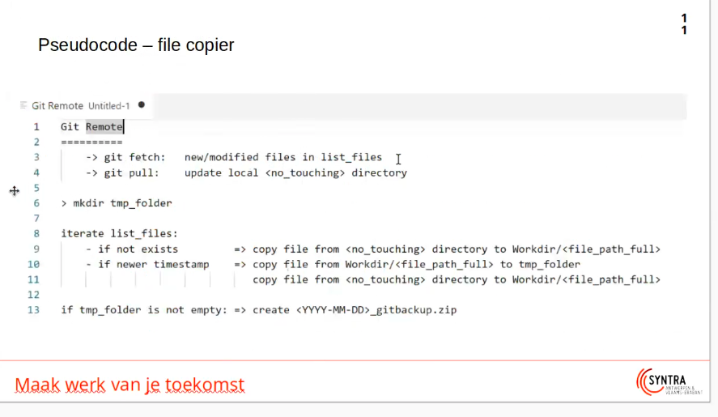
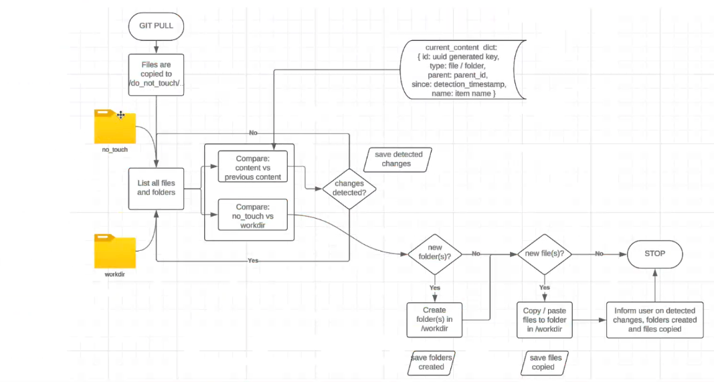

hier komt een programma dat de original repo van Olivier pulled 
en indien er nieuwe files zijn, deze kopieert naar de workdirectory
* als er een file veranderd is van de repo, en ik had deze al binnengeladen. Dat komt er bij mijn file _acl achter de naam te staan, en de originele file komt dan gewoon onder de repo.

